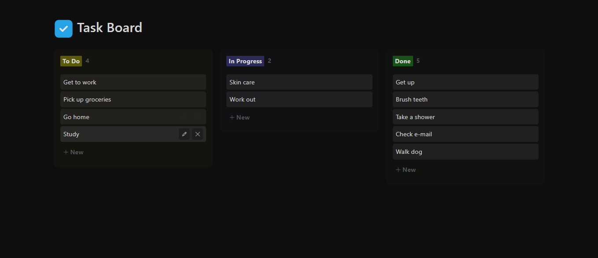

# AngularTaskBoard

AngularTaskBoard is a task management application built with Angular. It allows users to create, update, and delete tasks on a board. The application provides a simple and intuitive interface for managing tasks efficiently.



## Steps to Run the Application

1. Make sure you have `Node.js` installed on your machine. You can download it from https://nodejs.org.

2. Clone the repository to your local machine using the following command:

    ```$ 
    git clone https://github.com/naisireth/AngularTaskBoard.git
    ```

3. Navigate to the project directory:

    ```$ 
    cd AngularTaskBoard
    ``` 

4. Install the dependencies by running the following command:
   
   ```$
   npm install
   ``` 

5. Start the development server by running the command:

    ```$
    ng serve
    ```

    This will compile the application and start a local development server. You can access the application in your browser at [http://localhost:4200/](http://localhost:4200/). The application will automatically reload if you make any changes to the source files.


## Code Scaffolding

You can generate various components, directives, pipes, services, classes, guards, interfaces, enums, and modules using Angular CLI. Here are a few examples:

* Generate a new component: `ng generate component component-name`
* Generate a new directive: `ng generate directive directive-name`
* Generate a new pipe: `ng generate pipe pipe-name`
* Generate a new service: `ng generate service service-name`
* Generate a new class: `ng generate class class-name`
* Generate a new guard: `ng generate guard guard-name`
* Generate a new interface: `ng generate interface interface-name`
* Generate a new enum: `ng generate enum enum-name`
* Generate a new module: `ng generate module module-name`

## Code Scaffolding

```$
ng build
```
## Further Help

If you need further help with the `Angular CLI`, you can use the following command:

```$
ng help
```

You can also refer to the [Angular CLI Overview and Command Reference](https://angular.io/cli) page for more information and detailed documentation.